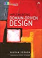

# Implementing Domain-Driven Design

by Vaughn Vernon

---

## Table of contents

- [Chapter 1: Getting Started with DDD](#chapter1)
- [Chapter 2: Domains, Subdomains, and Bounded Contexts](#chapter2)
- [Chapter 3: Context Maps](#chapter3)
- [Chapter 4: Architecture](#chapter4)
- [Chapter 5: Entities](#chapter5)
- [Chapter 6: Value Objects](#chapter6)
- [Chapter 7: Services](#chapter7)
- [Chapter 8: Domain Events](#chapter8)
- [Chapter 9: Modules](#chapter9)
- [Chapter 10: Aggregates](#chapter10)
- [Chapter 11: Factories](#chapter11)
- [Chapter 12: Repositories](#chapter12)
- [Chapter 13: Integrating Bounded Contexts](#chapter13)
- [Chapter 14: Application](#chapter14)

---

<a name="chapter1">
    <h1>Chapter 1: Getting Started with DDD</h1>
</a>

<a name="chapter2">
    <h1>Chapter 2: Domains, Subdomains, and Bounded Contexts</h1>
</a>

<a name="chapter3">
    <h1>Chapter 3: Context Maps</h1>
</a>
